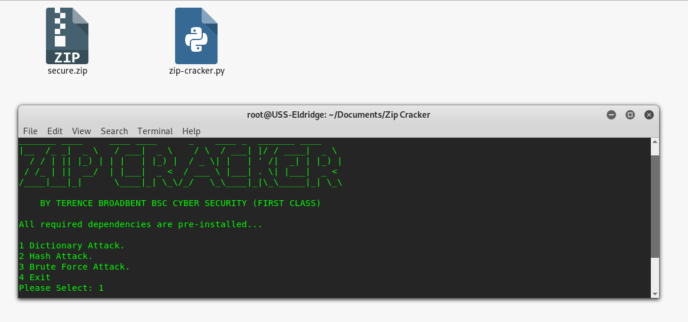

# ZIP-CRACKER

python zip-cracker.py secure.zip

Python script file to crack encrypted .zip files using bruteforce. The script is menu driven and allows the user to choose between a dictionary attack or a brute force attack on the specified file.

 
