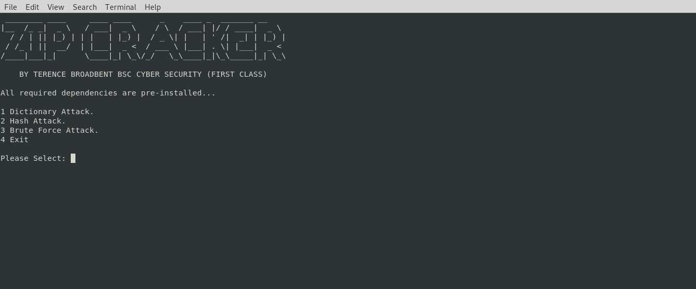

# ZIP CRACKER
## A PYTHON SCRIPT FILE TO CRACK ENCRYPTED .ZIP FILES USING A DICTIONARY ATTACK, A HASH ATTACK, OR A ALPHANUMERIC BRUTE FORCE ATTACK.

Usage: python3 zip-cracker.py secure.zip

| LANGUAGE | FILENAME       | MD5 HASH                         | CONTENTS      |
|--------  |---------       |---------                         |---------      |
| python3  | zip-cracker.py | bac267051733ea42584e288a88f7a7ea |               | 
| zip      | secure.zip     | 35ebcf246fbab4c7106dde9e0c57d8e4 | topsecret.jpg |

The script is menu driven and allows the user to choose between a dictionary attack, a hash attack, or a alphanumeric brute force attack on the specified file.

### CONSOLE DISPLAY
 
